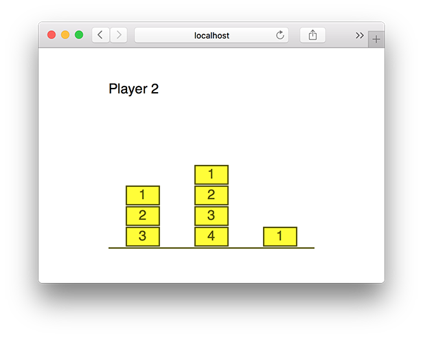

# Elm-Nim

A live-coded implementation of the [Nim](https://en.wikipedia.org/wiki/Nim) game in Elm as done at [Berlin Frontend Meetup](www.meetup.com/Zalando-Tech-Events-Berlin/events/231413778/).

You might also want to [check the slides here](http://unsoundscapes.com/slides/2016-06-07-introduction-to-elm/).

## Running

1. [Install Elm](http://elm-lang.org/install)
2. Start `elm reactor` from this dir
3. Open [http://localhost:8000/Main.elm](http://localhost:8000/Main.elm)
